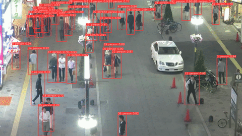
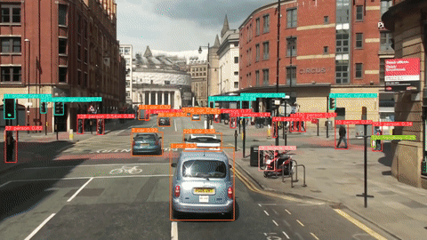

<div align="center">


# 🎯 SistemaDeteccionObjetos

### Sistema avanzado de detección y seguimiento de objetos en tiempo real 🚀

<p align="center">
  <b>YOLOv5 + StrongSORT + OSNet</b> combina detección de objetos, tracking multiobjeto y re-identificación avanzada para crear un sistema completo de visión artificial en tiempo real.
</p>

<p align="center">
  
  
  
  
  
</p>

</div>

---

# 📌 Descripción

Este proyecto implementa un sistema de seguimiento de objetos en tiempo real utilizando:

- 🔍 YOLOv5 para detección de objetos
- 🎯 StrongSORT para tracking multiobjeto
- 🧠 OSNet para re-identificación (ReID)
- 📹 OpenCV para procesamiento de video
- ⚡ PyTorch con aceleración GPU

El sistema es capaz de:

- Detectar personas, vehículos y objetos
- Mantener IDs persistentes
- Realizar tracking en tiempo real
- Procesar videos, webcams y streams RTSP
- Exportar resultados MOT
- Filtrar clases específicas

---

# ✨ Características

- 🎯 Seguimiento multiobjeto en tiempo real
- 📷 Compatible con webcam y videos
- 🌐 Soporte para streams RTSP/HTTP
- ⚡ Compatible con CUDA GPU
- 🧠 ReID avanzado con OSNet
- 📊 Exportación MOT
- 🔥 Soporte ONNX y TensorRT
- 🖥️ Compatible con Windows, Linux y macOS
- 📹 Tracking de personas y vehículos
- 🚀 Alto rendimiento y precisión

---

# 🧠 Tecnologías Utilizadas

| Tecnología | Descripción |
|------------|-------------|
| Python | Lenguaje principal |
| PyTorch | Deep Learning |
| YOLOv5 | Detección de objetos |
| StrongSORT | Tracking |
| OSNet | Re-identificación |
| OpenCV | Video Processing |
| CUDA | Aceleración GPU |

---

# 📂 Estructura del Proyecto

```bash
SistemaDeteccionObjetos/
│
├── strong_sort/
├── yolov5/
├── runs/
├── track.py
├── requirements.txt
└── README.md
```

---

# 🚀 Instalación

## 1️⃣ Clonar repositorio

```bash
git clone --recurse-submodules https://github.com/isairey/SistemaDeteccionObjetos.git
```

---

## 2️⃣ Entrar al proyecto

```bash
cd SistemaDeteccionObjetos
```

---

## 3️⃣ Instalar dependencias

```bash
pip install -r requirements.txt
```

---

# ▶️ Ejecución

## 📷 Webcam

```bash
python track.py --source 0
```

---

## 🎥 Video

```bash
python track.py --source video.mp4
```

---

## 🖼️ Imagen

```bash
python track.py --source image.jpg
```

---

## 🌐 Stream RTSP

```bash
python track.py --source rtsp://example.com/stream
```

---

# 🎯 Modelos YOLOv5

```bash
python track.py --source 0 --yolo-weights yolov5s.pt
```

Modelos disponibles:

- yolov5n.pt
- yolov5s.pt
- yolov5m.pt
- yolov5l.pt
- yolov5x.pt

---

# 🧠 Modelos OSNet

```bash
python track.py --source 0 --strong-sort-weights osnet_x1_0_msmt17.pt
```

---

# 🔍 Filtrar Objetos

## Solo personas

```bash
python track.py --source 0 --classes 0
```

---

## Gatos y perros

```bash
python track.py --source 0 --classes 16 17
```

---

# 📊 Guardar Resultados

```bash
python track.py --source video.mp4 --save-txt
```

Resultados:

```bash
runs/track/
```

---

# 📸 Vista Previa

<div align="center">

  

<br><br>


</div>

---

# 🧪 Casos de Uso

- 👮 Seguridad inteligente
- 🚦 Monitoreo vehicular
- 🏢 Vigilancia CCTV
- 🛒 Tiendas inteligentes
- 🤖 Robots autónomos
- 🚗 Vehículos inteligentes
- 📹 Analítica de video

---

# ⚡ Requisitos

- Python 3.8+
- PyTorch >= 1.7
- OpenCV
- CUDA GPU recomendada

---

# 📚 Recursos

- YOLOv5
- StrongSORT
- OSNet
- PyTorch
- OpenCV

---

# 👨‍💻 Desarrollador

### Isai Reyes - FullStack Developer

🔗 GitHub:
https://github.com/isairey

---


# 📜 Licencia

Licencia MIT.

Uso libre para proyectos personales y comerciales.

---

<div align="center">

### 🚀 Computer Vision • AI Tracking • Deep Learning

⭐ Dale una estrella al proyecto si te gustó ⭐

</div>
